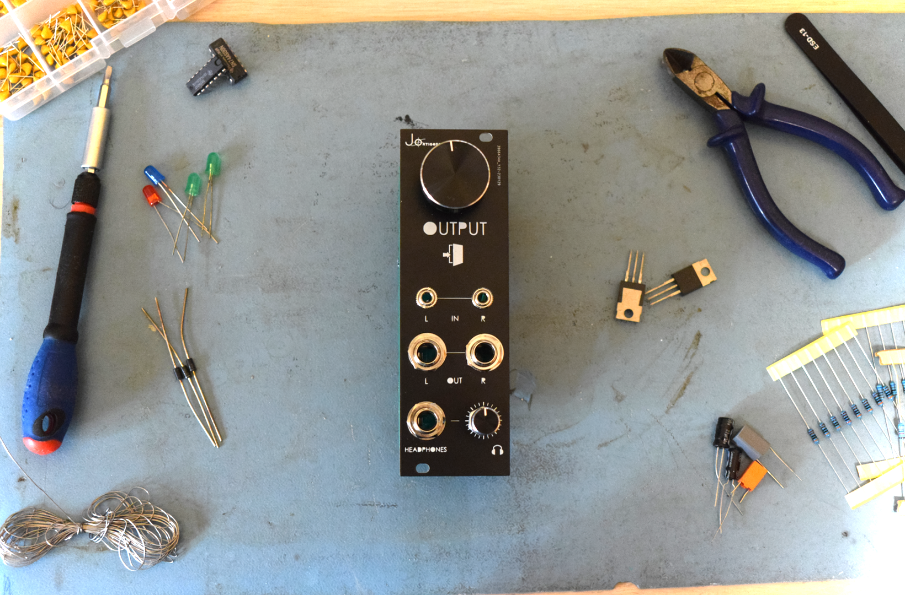

# Stereo output module with headphone driver
Simple Eurorack compatible output module with headphone driver.

## Features
- **EURORACK** compatible. 100KOhm input and 1KOhm output impedances. Compatible with eurorack sizes standard (128.5mm (3U) x 8HP).
- Simple stereo output module with **2 line ouputs (stereo)** and a stereo headphone driver.

## Components

Full list of components needed are included in the output.csv file. 

- Potentiometers need to be stereo (double). 
- Jack sockets are PJ301M-120 (3.5mm) and PJ-341 (6.3mm). 
- Parallel feedback capacitors are not needed but recommended.
- 2 LM386 auido amplifiers 

In order to save space and to reduce costs (since double alpha potentiometers are expensive), the pots are connected via wirees to the PCB.  

